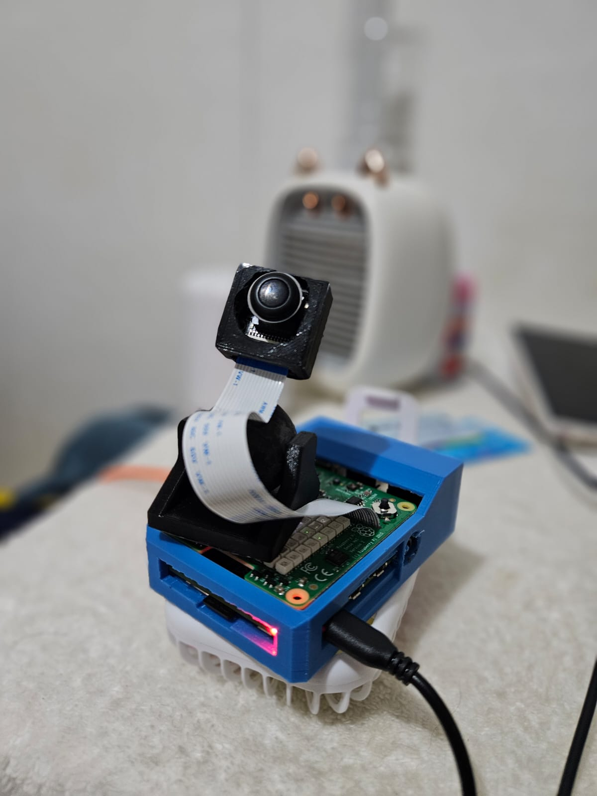
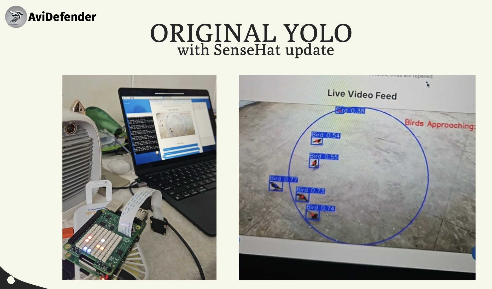
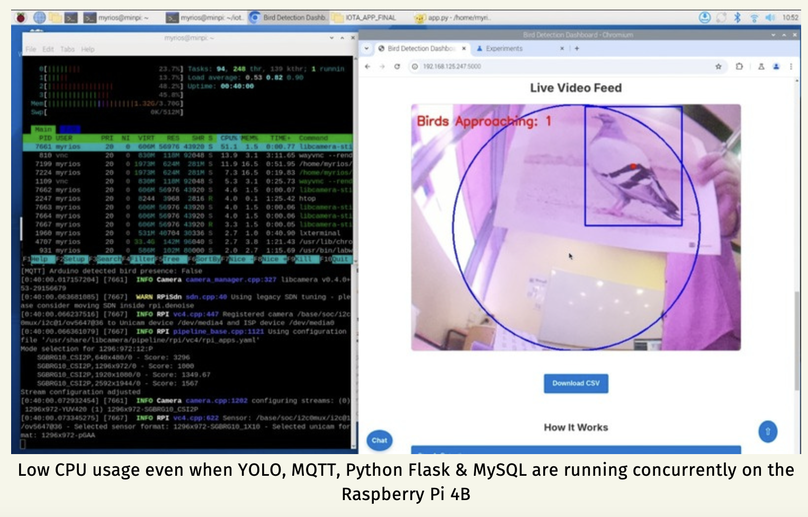

# AviDefender

## Introduction
AviDefender is an **AI-powered bird detection and deterrent system** designed for use in **hawker centers** to prevent birds from scavenging at tray return stations. The system uses a **Raspberry Pi** with a **YOLOv11-based object detection model** running on **TensorFlow Lite (TFLite)** for real-time bird detection. The detected bird activity is visualized through a **Flask web dashboard** as well as on the Pi SenseHat, and staff are alerted via web notification when birds are present.


## Features
- **Real-time Bird Detection**: Uses **libcamera** and **YOLOv11 (TFLite)** to identify birds in a live feed.
- **Non-Maximum Suppression (NMS)**: Filters out overlapping bounding boxes to improve accuracy.
- **Sense HAT Visualization**: Displays detected bird positions on an 8x8 LED grid.
- **Customizable Detection Settings**: Adjust detection radius and buzzer frequency via the web interface.
- **Flask Web Dashboard**: Provides live video streaming, bird count history, and customizable settings.
- **Alerts via Web Notifications**: Sends real-time notifications to staff when birds are detected.
- **MQTT Communication**: The Raspberry Pi acts as the MQTT broker, sending data to the **Arduino Uno WiFi Rev2**, which controls an ultrasonic deterrent system.
- **MySQL Integration**: Stores detection data in a remote **MySQL database** for analysis and retrieval.
- **Downloadable Data Logs**: Users can export detection history as a **CSV file**.
*(Although Raspberry Pi detection system itself is comprehensive enough, Arduino with an ultrasonic was a compulsory requirement of the project statement.)*



---

## YouTube Demo
We created a prototype demonstration and user walkthough video as well.
[](https://www.youtube.com/watch?v=6p_sFcpTxOY)

---

## System Architecture
1. **Bird Detection Module** (Raspberry Pi)
   - Captures frames via `libcamera-still`
   - Runs YOLOv5 TFLite inference
   - Displays real-time bounding boxes
   - Publishes bird presence data via MQTT

2. **Deterrent System** (Arduino Uno WiFi Rev2)
   - Receives bird detection status via MQTT
   - Activates buzzer deterrent based on Pi input
   - Sends back confirmation of deterrent activation

3. **Flask Web Dashboard**
   - Streams real-time detection feed
   - Allows setting adjustments (radius, buzzer pitch, deterrent toggle)
   - Displays live & historical bird count data
   - Sends staff notifications when action is required

4. **MySQL Database (Hosted on Mac)**
   - Stores timestamped detection data
   - Provides historical analysis for visualization
   - Allows downloading full detection logs in CSV format


---

## Installation Guide

### 1. **Setup Virtual Environment on Raspberry Pi**
```bash
python3 -m venv iot_env
source iot_env/bin/activate
pip install -r requirements.txt
```

### 2. **Install Required System Packages**
```bash
sudo apt update && sudo apt install -y libatlas-base-dev libhdf5-dev libhdf5-serial-dev libjasper-dev libqtgui4 libqt4-test
```

### 3. **Enable `libcamera` on Raspberry Pi**
```bash
sudo raspi-config
```
- Go to **Interface Options** → **Enable Camera**

### 4. **Start MQTT Broker on Raspberry Pi**
```bash
sudo systemctl start mosquitto
sudo systemctl enable mosquitto
```

### 5. **Set Up MySQL on Mac (a separate PC)**
Ensure the database details are updated in app.py and script.js as well.
```bash
brew install mysql
brew services start mysql
mysql -u root -p
```

Create the **bird_detection** database:
```sql
CREATE DATABASE bird_detection;
```
Create the **detections** table:
```sql
CREATE TABLE detections (
    id INT AUTO_INCREMENT PRIMARY KEY,
    timestamp DATETIME DEFAULT CURRENT_TIMESTAMP,
    radius INT NOT NULL,
    bird_count_inside INT NOT NULL,
    bird_count_outside INT NOT NULL,
    bird_locations TEXT NOT NULL,
    pitch INT NOT NULL,
    arduino_detected_bird BOOLEAN NOT NULL,
    deterrent_status BOOLEAN NOT NULL
);
```

### 6. (optional)Upload FinalArduinoCode.ino to an Arduino with wifi feature, connected to a buzzer and an ultrasonic sensor.

### 7. **Run Flask App on Raspberry Pi**
```bash
python app.py
```
The web interface will be available at:  
**http://<raspberry-pi-ip>:5000**

---

## Web Dashboard
### Live Features:
- **Video Stream**: Displays real-time bird detection
- **Adjustable Settings**:
  - Detection radius (scaled from 90px to 240px)
  - Buzzer pitch (1500Hz to 2300Hz)
  - Deterrent system toggle
- **Historical Bird Count Chart**: Last 10 detections
- **Download CSV**: Exports full detection log
- **Real-time Alerts**: Notifies staff when action is required

---

## Future Enhancements
- **Object Classification**: Differentiate between pigeons, crows, and other birds.
- **Automated Tray Cleaning Alerts**: Notify staff when trays are left unattended.
- **Integration with Cloud Services**: Store detection history on Google Cloud or AWS for deeper analytics.
- **AI-Powered Smart Deterrent**: Optimize buzzer activation based on bird behavior patterns.

---

## Product Impact
### **User-Friendliness**
✅ **Web-based Control Panel**: Easily accessible via any device.  
✅ **Adjustable Parameters**: Allows fine-tuning of detection settings.  
✅ **Instant Notifications**: Alerts staff before birds become a problem.

### **Efficiency & Performance**
⚡ **Lightweight Model (TFLite)**: Runs efficiently on Raspberry Pi.  
⚡ **Fast Processing**: Captures and detects birds in real-time.  
⚡ **Optimized for Edge Computing**: Works without internet connectivity.

### **Scalability & Adaptability**
🔄 **Can be deployed in multiple locations** (food courts, public areas, etc.)  
🔄 **Modular Design**: Can integrate additional deterrent methods (e.g., water spray, lights)  
🔄 **Data Logging & Analysis**: Helps identify bird activity patterns over time.

---

## 💎 Authors & Credits
[Year 2, AI Engineering Project, Diploma in AI & Data Engineering, Nanyang Polytechnic]
- [**Min Phyo Thura**](https://github.com/myriosMin)    
- [Mohammad Habib](https://github.com/habibmohammad35) 
- Ryan Yong

For inquiries, please contact **Min**.

---

## License
MIT License with Common Clause © 2025 AviDefender Team